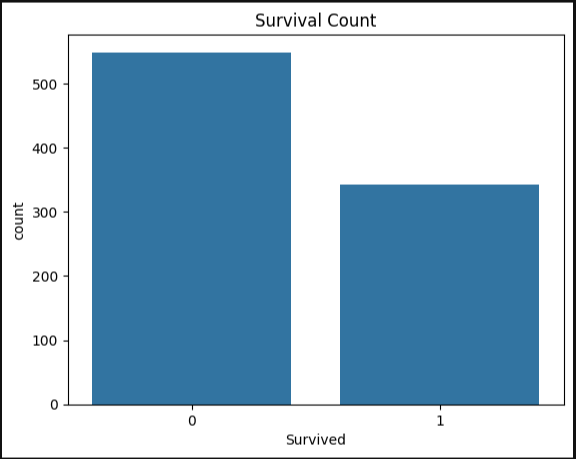
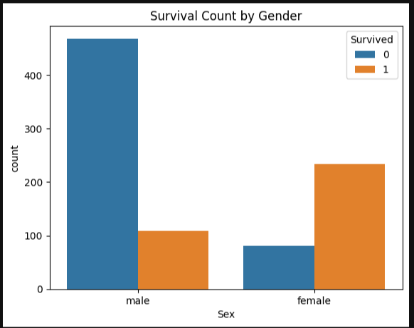
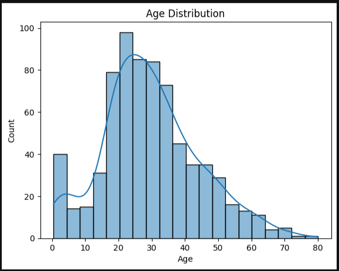
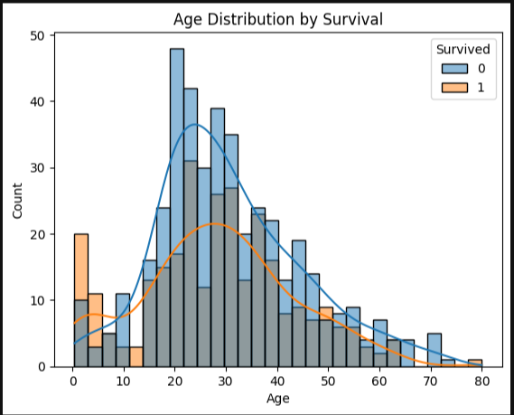
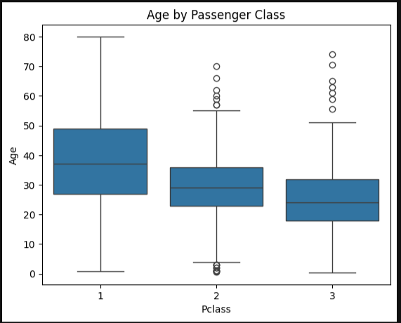

# titanic-eda-project
Exploratory Data Analysis of Titanic survival dataset using Python, pandas, and seaborn
# 🧠 Titanic Survival EDA Project

Exploratory Data Analysis of Titanic survival dataset using Python, pandas, and seaborn.

## 📋 Overview

This project explores factors that influenced passenger survival during the Titanic disaster. It uses Python, `pandas`, and `seaborn` to analyze and visualize data patterns that may have impacted survival outcomes. The goal was to build analytical confidence through real-world data exploration.

---

## 🔍 Key Questions Explored

- What % of passengers survived?
- Did gender affect survival rates?
- Did passenger class matter?
- Were younger passengers more likely to survive?
- Did family size influence survival?

---

## 💡 Insights

- Only **38% of passengers survived**, while **62% did not**
- **Women** were significantly more likely to survive than men
- **1st class passengers** had a **63% survival rate** vs only **24% in 3rd class**
- **Children under 10** had noticeably higher survival rates
- **Small families (2–4 members)** had better survival odds compared to solo travelers and large families

---

## 📊 Visuals

#### 🎯 Survival Count

#### 🧍 Survival by Gender

#### 🧍‍♂️ Survival Count by Gender

#### 🎂 Age Distribution

#### 📈 Age Distribution by Survival

#### 🧳 Age by Passenger Class

---

## 🧰 Tools Used

- Python
- pandas
- matplotlib
- seaborn
- Jupyter Notebook

---

## 📁 Files Included

- `Titanic_EDA.ipynb` – Full analysis notebook
- `.png` images – Visualizations saved from the notebook
- `README.md` – Project summary and visuals for GitHub

---

## 🚀 Next Steps

- Build a **predictive model** (e.g., logistic regression) to predict survival
- Turn insights into a **Streamlit web dashboard**
- Expand to other real-world datasets (supply chain, telecom churn, etc.)

---

👨🏽‍💻 Created as part of a beginner-to-advanced AI/data journey. Let’s connect on LinkedIn if you’re exploring similar paths!

